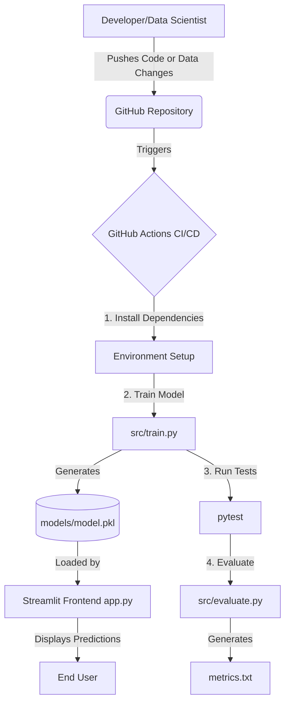

# End-to-End MLOps CI/CD Pipeline with Streamlit and GitHub Actions

## 🎯 Project Objective
This beginner-friendly project demonstrates the fundamental concepts of **MLOps (Machine Learning Operations)** and **CI/CD (Continuous Integration and Continuous Delivery)**. 

The objective is to create an automated machine learning pipeline where:
1. A Machine Learning model is trained on a dataset.
2. A frontend UI (Streamlit) is provided to interact with the model and make predictions.
3. A GitHub Actions pipeline automatically reruns tests and retrains the model whenever the source code or dataset changes.
4. Changes in the model's behavior are visibly reflected in the frontend application.

## 🏗️ Architecture Diagram


## 🔄 MLOps Lifecycle & CI/CD Explanation
### What is MLOps?
MLOps is a set of practices that aims to deploy and maintain machine learning models in production reliably and efficiently. It combines Machine Learning, DevOps, and Data Engineering.

### What is CI/CD in this context?
- **Continuous Integration (CI):** Every time we change the code or data, automated tests are run to ensure we didn't break anything (e.g., `pytest` checking if the model still outputs valid predictions).
- **Continuous Delivery/Training (CD):** Once tests pass, the pipeline automatically retrains the model on the latest data and code, producing a new `model.pkl` ready for the Streamlit app to use.

## ⚙️ Workflow Explanation
The project is structured into modular components:
1. **Data (`data/diabetes.csv`):** The dataset used for training.
2. **Preprocessing (`src/preprocess.py`):** Loads the CSV and splits it into training and testing sets.
3. **Training (`src/train.py`):** Trains a `RandomForestClassifier` and saves it.
4. **Evaluation (`src/evaluate.py`):** Calculates the model's accuracy on the test set.
5. **Testing (`tests/test_model.py`):** Uses `pytest` to automatically verify functionality.
6. **Frontend (`app.py`):** A Streamlit app that loads the trained model and provides a UI for predictions.

## 🤖 GitHub Actions Explanation
The CI/CD pipeline is defined in `.github/workflows/ml_pipeline.yml`. It is configured to trigger **only** when changes are pushed to `src/`, `data/`, or `app.py`. 

The pipeline performs the following steps automatically:
1. Sets up a Python environment.
2. Installs required libraries from `requirements.txt`.
3. Runs `train.py` to generate the model.
4. Runs `pytest` to ensure the model functions correctly.
5. Runs `evaluate.py` to output `metrics.txt` for tracking model accuracy.

## 🖥️ Frontend Explanation
We use **Streamlit**, a fast and easy way to build data apps. The `app.py` script creates sliders for the 8 patient health metrics (Pregnancies, Glucose, Blood Pressure, Skin Thickness, Insulin, BMI, Diabetes Pedigree Function, Age). When the user clicks "Predict Risk", it feeds these values into `models/model.pkl` and displays the predicted outcome along with the confidence probabilities for each class.

---

## 🚀 How to Run the Project Locally

### 1. Prerequisites
Ensure you have Python installed.

### 2. Virtual Environment Setup
Open your terminal and run the following commands:
```bash
# Create a virtual environment
python -m venv venv

# Activate it (Windows)
venv\Scripts\activate
# Activate it (Mac/Linux)
# source venv/bin/activate
```

### 3. Installation
```bash
# Install required packages
pip install -r requirements.txt
```

### 4. Train the Initial Model
Before running the frontend, you must generate the `model.pkl` file.
```bash
# Run the training script
python src/train.py
```

### 5. Start the Streamlit Frontend
```bash
# Run the application
streamlit run app.py
```
This will open the web app in your browser (usually `http://localhost:8501`).

### 6. Docker Containerization (Optional)
If you need to run this project in a container:
```bash
# Build the Docker image
docker build -t diabetes-predictor:latest .

# Run the container
docker run -p 8501:8501 diabetes-predictor:latest
```

### 7. Kubernetes Deployment (Optional)
To deploy this on a local Kubernetes cluster (like Minikube):
```bash
# Apply the deployment
kubectl apply -f k8s/deployment.yaml

# Apply the service
kubectl apply -f k8s/service.yaml

# Check running pods
kubectl get pods

# Expose the service (if using Minikube)
minikube service mlops-diabetes-service
```

---

## 🧪 Demonstration Scenarios

### Scenario 1: Source Code Change Demo
**Goal:** Show how changing the machine learning code affects predictions and triggers the automated pipeline.

1. Run the Streamlit app (`streamlit run app.py`).
2. Input some values: e.g., Glucose=117, BMI=32.0. Note the prediction probabilities.
3. Open `src/train.py`.
4. Change the model hyperparameters. For example, change:
   `model = RandomForestClassifier(n_estimators=100, random_state=42)` 
   to 
   `model = RandomForestClassifier(n_estimators=5, max_depth=2, random_state=42)`
5. Commit and push the changes:
   ```bash
   git add src/train.py
   git commit -m "Changed hyperparameters to demonstrate CI/CD"
   git push origin main
   ```
6. **Watch the GitHub Actions pipeline run automatically** in your repository's "Actions" tab.
7. Once the pipeline completes successfully, pull the changes (if testing locally) and run `train.py` again (the pipeline runs on GitHub's servers, to see the change locally you run train.py locally).
8. Refresh your Streamlit app. You will see that the prediction probabilities for the exact same inputs have changed due to the new model architecture!

### Scenario 2: Dataset Change Demo
**Goal:** Show how changing the underlying data triggers retraining.

1. Open `data/diabetes.csv`.
2. Manually edit some rows. For instance, change a few `0` outcomes to `1`, or change the feature values of the first row to be drastically different.
3. Commit and push the changes:
   ```bash
   git add data/diabetes.csv
   git commit -m "Modified dataset to demonstrate CI/CD"
   git push origin main
   ```
4. **Watch the GitHub Actions pipeline trigger automatically.** The pipeline detects a data change and retrains the model.
5. Retrain locally and refresh Streamlit. The model's behavior will have shifted because it learned from different data.

---

## 📸 Screenshots
*(Add your screenshots here for the final presentation)*

### Streamlit UI Initial State


### GitHub Actions Triggering on Push


### Changed Probabilities After Retraining


---

## 🔧 Git Commands Quick Reference
```bash
# Initialize git repository
git init

# Add all files
git add .

# Commit changes
git commit -m "Initial commit of MLOps project"

# Link to your GitHub repository
git remote add origin <your-github-repo-url>

# Push code to GitHub
git push -u origin main
```
